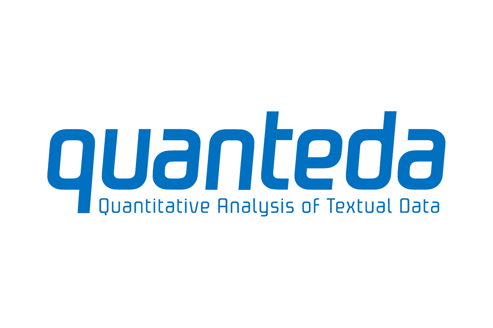

```{r setup, include=FALSE, cache = TRUE}
knitr::opts_chunk$set(echo = FALSE, warning = FALSE, error = FALSE, message = FALSE, cache = TRUE)
```

```{r, load-packages, include = FALSE}
library(tidytext)
library(tidyverse)
library(ggplot2)
library(dplyr)
library(readr)
library(plotly)
library(stringr)
library(readxl)
library(wordcloud)
library(reshape2)
library(ggwordcloud)
library(lubridate)
```

```{r, echo=FALSE, out.width="25%", fig.height=3, fig.width=2, fig.align="center"}
knitr::include_graphics("tidytextlogo.png")
```

## Package Overview{.tabset}
TidyText is intended to help with Text Mining in R, and provide supplemental functions for the mining process. The latest version of the tidytext package is v0.2.6, created by Julia Silge and David Robinson, and was first created in 2016 after realizing that the data wrangling process in relation to text data was quite difficult in comparison to normal data mining processes. This package is most ideally used hand-in-hand with dplyr, ggplot2, tidyr, broom, and other packages that help with tidying and visualizing data. Text mining is made exceptionally easier and effective through the use of tidy data methodologies and principles. Tidytext’s primary function is to provide some additional tools to further streamline the process of converting text to a tidy format, and allow for a swift and simple transition between raw text data and tidy tools for text mining and visualization. 

```{r, echo=FALSE, out.width="75%", fig.height=3, fig.width=2, fig.align="center"}
knitr::include_graphics("tidytextprocess.png")
```

The ultimate goal is to be able to turn text into a dataframe format of each word for easy summarization and visualization. Sentimental analysis, common word choice, and other characteristic visualizations of the text are infinitely simpler through this conversion. As a whole, the functions are fairly simple to understand and use - it’s the expanse of applications that are the focus of what this package can help do. This package also contains various text datasets pre-loaded that can be used for the purposes of text mining too.

### Package Dependencies
There are no real dependencies, but in order to actually move forward with drawing conclusions and analysis of the dataframe you will create with the tidied word data, standard tidy packages like **dplyr**, **tidyr**, **ggplot2**, and **broom** should be used.

Because tidytext essentially sets up text data to be manipulated, there are many packages in the R environment that it can be used cohesively with. For example, **readr** is a package that allows you to read in files that are in the CSV format, tab separated, general delimited (text files), and more. **Stopwords** is an R package that has an aggregation of stopwords from multiple different data sources on the internet so that it is easy to gather a general list of stop words that you can then remove from text files to ensure more robust analysis. They can be looked up by starting letters and source. Stop words are words in a language that do not offer much meaning or value to the sentence. 

### Version History
The current version is v0.2.6 published on September 20th, 2020, with the earliest version being v0.1.0, made in 2016. 


## Examples of Usage{.tabset}

### Twitter Data
One particularly interesting usage for tidytext is analyzing data from social media websites, such as Twitter. To show this, I requested my data archive for my NBA Draft Scouting account (@ kalidrafts), and I will look to see which words I most frequently use in my tweets.

The most challenging part of using tidytext is cleaning the data to match the desired format. Twitter provides a JSON file that must be first converted to a CSV using R. Once imported, the column headers are extremely complex and hard to read (often containing double underscores), and a ton of NA values.

```{r echo = TRUE, results = 'hide', cache=TRUE, warning=FALSE, message=FALSE}
tweets_nick <- read_csv("tweet.csv")
drops <- c("tweet__retweeted","tweet__truncated", "tweet__favorited", "tweet__possibly_sensitive", "tweet__extended_entities__media__type")
#Dropping all the columns with values of type boolean - not particularly necessary, but will make the new dataframe easier to replace NAs
tweets_nick_drop <- tweets_nick[ , !(names(tweets_nick) %in% drops)]
tweets_nick_drop <- tweets_nick_drop %>%
                    mutate_all(as.character)
#Converts all the columns with type "double" to "character"
tweets_nick_drop[is.na(tweets_nick_drop)] <- "0"
#Replaces all NAs with 0's.
```

Now that the dataframe is properly formatted, we can begin using tidytext and dplyr functions to manipulate the data to produce the desired results. We will first filter out all of the retweets (tweets that I re-posted but contain no words from me). Then we will convert the column "tweet__full_text" (the column which contains the body of the tweet) into a character tibble so that we can analyze it.

```{r,cache=TRUE, echo=TRUE, warning=FALSE, message=FALSE}
tweets_nick_with_content <- filter(tweets_nick_drop, tweet__full_text != "0") #filters out retweets
tweet_content <- tweets_nick_with_content$tweet__full_text
text_df <- tibble(line = 1:197, text = tweet_content)
text_df <- mutate(text_df, text = tweet_content) #creation of the tibble using the tidyverse function "mutate"
```

We can use the tidytext function unnest_tokens to split all of the tweets into individual character vectors, each containing one word. Then, we can use the count() function to produce a tibble containing each word and its frequency.

```{r,cache=TRUE, echo=TRUE, warning=FALSE, message=FALSE}
word_count <- text_df %>% unnest_tokens(word, text) %>%  count(word, sort = TRUE)
word_count <- filter(word_count, word != "https") #I found out that the count() function also included parts of hyperlinks as words. So the next three lines filter these out.
word_count <- filter(word_count, word != "t.co")
word_count <- filter(word_count, word != "n")
word_count
```

Finally, the tibble produced by tidytext can be easily integrated into ggplot to create a bar graph visualization of the data. 

```{r,cache=TRUE, echo=TRUE, warning=FALSE, message=FALSE}
new_word_count <- head(word_count,25) #take the 25 most frequently used words
word_count_graph <- ggplot(data=new_word_count, aes(x=reorder(word, -n), y=n))  +
                    geom_bar(stat='identity') + xlab("Word") + ylab("Frequency")
word_count_graph
```

### Presidential Debate Data
```{r,cache=TRUE, echo=TRUE, warning=FALSE, message=FALSE}
#load in debate transcript data
transcript <- read_excel("debate_text3.xlsx")
View(transcript)
```

The purpose of this example is to analyze the transcript from the recent 2020 Presidential Debate. With tidytext, it is possible to extract the most frequently used words by each candidate, and you can even perform a sentiment analysis on the words used throughout the debate. Using tidytext, I created "word clouds" for each candidate that display their most used words throughout the debate, and I also created a plot that expresses the sentiment of the debate (Trump, Biden, and the moderator included) versus time.

```{r,cache=TRUE, echo=TRUE, warning=FALSE, message=FALSE}
#create a "tidy" df from the transcript data by using features like unnest_tokens and stop_words
tidy_transcript <- transcript %>%
  unnest_tokens(word, text) %>% #separates text column from chunks of text to one word rows
  anti_join(stop_words) %>% #excludes ultra common words such as "a", "the", "of", etc.
  group_by(speaker) %>%
  count(word, sort=TRUE) %>% #counts the frequency of each word and sorts from highest to lowest
view(tidy_transcript)
#create a subset of trump's most used words
trump_subset <- tidy_transcript %>% 
  filter(speaker == "President Donald J. Trump")
trump_subset <- trump_subset[-c(2,3,5,6,8,9,10,13,16,18,19,24,29,32,36,38,41,52,53,54,60,61,76,77,78,79,80,89,105,108), ] #removes words that were missed by "stop_words" (these were primarily numbers)
view(trump_subset)
#create a word cloud from the 105 most frequently used words
trump_cloud <- trump_subset %>%
  with(wordcloud(word, n, max.words = 105))
#create a subset of biden's most used words
biden_subset <- tidy_transcript %>% 
  filter(speaker == "Vice President Joe Biden")
biden_subset <- biden_subset[-c(2,3,4,5,7,8,12,13,15,17,19,27,30,34,39,52,65,66,74,84,85,87,88,89,103,104,121,127,128,129,130,131,132), ] #removes words missed by stop_words
view(biden_subset)
#creates word cloud
biden_cloud <- biden_subset %>%
  with(wordcloud(word, n, max.words = 105))
```


```{r,cache=TRUE, echo=TRUE, warning=FALSE, message=FALSE}
#plots the sentiment of the debate vs time
unnested <- transcript %>%
  unnest_tokens(word, text) %>% #tidy the data
  anti_join(stop_words) %>%
  mutate(minutes = seconds_in*(1/60)) %>% #create a minutes column
  inner_join(get_sentiments("bing")) #uses the sentiment lexicon "bing" which categorizes words in a binary fashion into positive and negative categories
view(unnested)
debate_sentiment <- unnested %>%
  count(index = minutes %/% 1, sentiment) %>% #creates time index
  spread(sentiment, n, fill = 0) %>% #creates separate columns for positive and negative sentiments
  mutate(sentiment = positive - negative) #calculate new sentiment
view(debate_sentiment)
#plot net sentiment vs time to see the "story" of the debate
ggplot(debate_sentiment, aes(index, sentiment)) +
  geom_col(show.legend = FALSE)+
  xlab("Time Index")+
  ylab("Sentiment")+
  ggtitle("Debate Sentiment vs Time")+
  annotate(geom='text',
           x = 60, y = 7,
           label=glue::glue("Sentiment above x-axis = positive, below = negative"),
           size=4)+ #add label explaining 
  theme_minimal()
#as expected (if you watched the debate) the sentiment is primarily negative throughout the entire debate!
```

### Harry Potter Data
tidytext can be used for the purpose of analyzing word and document frequencies as well. The purpose of this would be to better understand what types of words are common amongst sets of works, as well as figure out what distinguishing words/characteristics of words are used to separate texts from one another. For this example I will be analyzing the word frequency from the 7 different Harry Potter books that author J.K. Rowling has written. Tf, or term frequency, is used to describe how often a word is mentioned within a document. However, many stopwords, or words that are indifferent to the meaning of the sentence, will result in having often times very large tf's due to the their frequent use in the english language. To account for this, inverse document frequency, or idf, can be used which essentially decreases the weight for commonly used words, and in turn will cause more rare words to have heavier weights. Multiplying tf and idf together will produce an adjusted term frequency based on the term's rarity. 

```{r, cache=TRUE, warning=FALSE, message=FALSE, echo=TRUE}
hp1 = read.delim("hp1.txt", header = TRUE, sep = "\t")
hp1 = hp1 %>% mutate(line=row_number(), text=Harry.Potter.and.the.Sorcerer.s.Stone) %>% select(-1)
hp2 = read.delim("hp2.txt", header = TRUE, sep = "\t")
hp2 = hp2 %>% mutate(line=row_number(), text=X1) %>% select(-1)
hp3 = read.delim("hp3.txt", header = TRUE, sep = "\t")
hp3 = hp3 %>% mutate(line=row_number(), text=CHAPTER.ONE.OWL.POST) %>% select(-1)
hp4 = read.delim("hp4.txt", header = TRUE, sep = "\t")
hp4 = hp4 %>% mutate(line=row_number(), text=Harry.Potter.and.the.Goblet.of.Fire.by.J.K..Rowling) %>% select(-1)
hp5 = read.delim("hp5.txt", header = TRUE, sep = "\t")
hp5 = hp5 %>% mutate(line=row_number(), text=Harry.Potter.and.the.Order.of.the.Phoenix) %>% select(-1)
hp6 = read.delim("hp6.txt", header = TRUE, sep = "\t")
hp6 = hp6 %>% mutate(line=row_number(), text=Table.of.Contents.) %>% select(-1)
hp7 = read.delim("hp7.txt", header = TRUE, sep = "\t")
hp7 = hp7 %>% mutate(line=row_number(), text=Harry.Potter.and.the.Deathly.Hallows.By.J..K..Rowling) %>% select(-1)
```

The unnest_tokens() function is used to separate the preloaded text files from each of the 7 books into a dataframe with one column named 'word' that has one token per line. Then, dplyr functions with summarise are used to find counts of each word for each text file. 
```{r, warning=FALSE, message=FALSE, echo=TRUE}
hp1 = hp1 %>% unnest_tokens(word, text) %>% group_by(word) %>% summarise(count = n())
hp2 = hp2 %>% unnest_tokens(word, text) %>% group_by(word) %>% summarise(count = n())
hp3 = hp3 %>% unnest_tokens(word, text) %>% group_by(word) %>% summarise(count = n())
hp4 = hp4 %>% unnest_tokens(word, text) %>% group_by(word) %>% summarise(count = n())
hp5 = hp5 %>% unnest_tokens(word, text) %>% group_by(word) %>% summarise(count = n())
hp6 = hp6 %>% unnest_tokens(word, text) %>% group_by(word) %>% summarise(count = n())
hp7 = hp7 %>% unnest_tokens(word, text) %>% group_by(word) %>% summarise(count = n())
```

```{r, cache=TRUE,warning=FALSE, message=FALSE, echo=TRUE}
#harry potter 1
hp1_tot = sum(hp1$count)
hp1$total = replicate(nrow(hp1), hp1_tot)
hp1$book = replicate(nrow(hp1), "Sorcerer's Stone")

#harry potter 2
hp2_tot = sum(hp2$count)
hp2$total = replicate(nrow(hp2), hp2_tot)
hp2$book = replicate(nrow(hp2), "Chamber of Secrets")

#harry potter 3
hp3_tot = sum(hp3$count)
hp3$total = replicate(nrow(hp3), hp3_tot)
hp3$book = replicate(nrow(hp3), "Prisoner of Azkaban")

#harry potter 4
hp4_tot = sum(hp4$count)
hp4$total = replicate(nrow(hp4), hp4_tot)
hp4$book = replicate(nrow(hp4), "Goblet of Fire")

#harry potter 5
hp5_tot = sum(hp5$count)
hp5$total = replicate(nrow(hp5), hp5_tot)
hp5$book = replicate(nrow(hp5), "Order of the Pheonix")

#harry potter 6
hp6_tot = sum(hp6$count)
hp6$total = replicate(nrow(hp6), hp6_tot)
hp6$book = replicate(nrow(hp6), "Half-Blood Prince")

#harry potter 7
hp7_tot = sum(hp7$count)
hp7$total = replicate(nrow(hp7), hp7_tot)
hp7$book = replicate(nrow(hp7), "Deathly Hallows")

#combine into one big dataframe for tf and tf-idf analysis
all_books = rbind(hp1, hp2, hp3, hp4, hp5, hp6, hp7)
```

Using the bind_tf_idf() function in tidytext, we can create 3 new columns in our dataframe that will automatically calculate the term frequency, inverse document frequency, and the tf-idf.
```{r, cache=TRUE,warning=FALSE, message=FALSE, echo=TRUE}
all_books = all_books %>% bind_tf_idf(word, book, count) %>% arrange(desc(tf_idf))
```

```{r,warning=FALSE, message=FALSE, fig.align="center"}
ggplot(all_books, aes(count/total, fill = book)) +
  geom_histogram(show.legend=FALSE) + facet_wrap(~book)
```
This first faceted histogram shows the extremely skewed distribution of term frequencies for each of the 7 books being analyzed. As expected, there are many words with high tfs, which we can assume are in relation to the large number of stopwords that most texts possess. However, there are noticably long takes on these histograms indicating the presence of more unique words in the book as well.

This next graph now displays the top 10 words with the highest tf-idf value for each of the 7 texts. We can see the uniqueness of the majority of these words, as well as their specification to their respective books. This tells us that for the most part it seems as though the general language usage across all of J.K. Rowling's books in the series is similar. The characters are all similar for the most part, which is why we do not see names like Harry, Hermione, or Ron in the tops of these charts, as they are common and frequent across all documents in our set. We see now words are are frequent for their own book and thus allows for differentiation. These are words like the names of the specific professors that played large roles per book, as well as things like hallow for the 7th book. 

```{r,warning=FALSE, message=FALSE, fig.align="center"}
all_books %>% group_by(book) %>% top_n(10) %>% ungroup() %>% mutate(word = as.factor(word)) %>%
  ggplot(aes(x=word, y=tf_idf, fill=book)) + geom_col(show.legend=FALSE) + 
  facet_wrap(~book, scales="free") +
  coord_flip()
```


## Similar Packages{.tabset}
There are quite a few different packages that are available in R that lend assistance to data scientists in the task of text mining and text data analysis. 

### Quanteda
```{r, echo=FALSE, out.width="25%", fig.height=3, fig.width=2, fig.align="center"}

```
Quanteda is a framework for text analysis in R that provides the ability to more efficiently manage, wrangle, and manipulate multiple texts and text files through R. Similar to tidytext, it allows you divide the lines of text into different tokens, or a large character vector or dataframe of the text broken up by word (token). There is a token function in both packages to allow this to happen. N-grams are are consecutive sequences of words, which are similar at multiple instances in the text. The token function in tidytext allows you to specify the size of the ngrams that you want to divide the text into, and it will generate a data table of these ngrams. Quanteda allows for creation of ngrams as well. In addition, both packages support characterizing data, analyzing words, and sentiment analysis to some degree. The key difference I would highlight between these two packages is that Quanteda is more comprehensive in sense that it has its own built-in plotting, visualization, character manipulation, and general text related functions. With tidytext, this is done through the initial tidying of data, but using tidy packages to actually move forward in terms of any type of dataframe manipulation and using packages like ggplot in order to do any sort of data visualization and graphing. There are also a lot more indepth visualization methods in quanteda like similarity matrices, network plots, word clouds, etc. 

### Text2vec
Text2vec is a source-agnostic API service, meaning researchers are able to work on collections from different sources that may be larger than the available storage on the laptop or device that the research is working on. This package is good for building machine learning algorithms that have to do with text data. It allows you to create document term matrices or term co-occurrence matrices from the text files that you input into it. This package, while it's also a text mining framework, is much more advanced than tidytext and is used ideally for much larger text mining projects. It has tools for text vectorization, like tidytext, but also topic modeling and GloVe, which is Global Vectors for Word Representation. All in all, this package is intended for a lot more advanced text mining, while tidytext allows for simple still insightful analysis.

### Stringr
```{r, echo=FALSE, out.width="25%", fig.height=3, fig.width=2, fig.align="center"}
knitr::include_graphics("stringr.png")
```
This package is similar to tidy text in the sense it also deals with the manipulation of text with character vectors and strings. It also helps with the cleaning of any data that has to do with strings/characters - text data. It allows for the use of regular expressions when analyzing data, and can be used for things like figuring out instances of certain words or letters in strings, or in this case, tokens. Additionally, it allows you to order and sort vectors of type character, and tidytext and the tidy tools its used with also have the ability to do the same.

### Spacyr
```{r, echo=FALSE, out.width="25%", fig.height=3, fig.width=2, fig.align="center"}

```
SpaCyr is an R wrapper to the Python SpaCy "industrial strength natural language processing" library. Both spaCyr and tidytext have a base function to be able to tokenize the text that you are trying to analyze. In tidytext this is the unnest_tokens() function; in spaCyr this is the spacy_parse() function. However, a key difference here is that the depth of the unnest_tokens() function has an argument to specify the token and an argument to specify the format of what you are tokenizing. There are a few other arguments you can specify, however they are not included in the default. The base situation then is splitting the file into one column with all of the units as an individual row/element. Tidy tools like tidyverse and dplyr can then be used to manipulate the dataframe and add more information and columns to specific each of the tidy rows. spacy_parse() will take in a labeled character vector of the documents and output a dataframe as well, however with many more pre-described columns like "doc_id", "sentence_id", "token_id", "token", "lemma", "pos", "entity". All in all from the get go it's a lot more in depth with both capitalized and lowercase token columns, parts of speech defined, as well as entity recognition automatically. spaCyr is also very interesting in that you can use it for different languages of text as well. Similar to tidytext, it does not have any built-in function for data visualization, and would require the use in conjunction with another package like ggplot in order to visualize any sort of information.  

## Reflection

### Pros
1. Tidytext can be very easily integrated with other packages, such as dplyr, tidyr, and ggplot to easily organize data and create data visualizations
2. The sentiments function can help determine opinion and reaction to ideas, projects, or other marketing tools
3. Tidytext can be paired with other packages, such as topic modeling, to further increase the analytical power of text models
4. When given a clean dataset, tidytext produces simple and ready-to-use dataframes

### Cons
1. Can be very difficult to manipulate and reformat data. Often requires multiple tidyr commands to produce the desired dataframe
2. Sentiments function does not take context into account. A word given a negative grade could be used in a positive context, but will still be counted as negative
    a. E.g. “The company abandoned previous bad practices in favor of a newer business model” - “abandon” will still classify as negative

### Potential Added Features
1. Built in commands specific for commonly mined websites (Google, Twitter, Facebook, etc.), to simplify the data reformatting process
2. Improved sentiment algorithm which includes context


## Works Cited{.tabset}

### Content
1. [TidyText Mining Book](https://www.tidytextmining.com/)
2. [TidyText R Documentation](https://www.rdocumentation.org/packages/tidytext/versions/0.2.6)
3. [R Packages for Text Analysis](https://towardsdatascience.com/r-packages-for-text-analysis-ad8d86684adb)
4. [Quanteda R Documentation](https://www.rdocumentation.org/packages/quanteda/versions/2.1.2)
5. [Harry Potter Text Files](http://www.glozman.com/textpages.html)
6. [Readr R Documentation](https://www.rdocumentation.org/packages/readr/versions/1.3.1)
7. [Stopwords R Documentation](https://www.rdocumentation.org/packages/stopwords/versions/2.0)
8. [text2vec R Documentation](https://www.rdocumentation.org/packages/text2vec/versions/0.6)
9. [Stringr R Documentation](https://www.rdocumentation.org/packages/stringr/versions/1.4.0)
10. [spaCyr R Documentation](https://www.rdocumentation.org/packages/spacyr/versions/0.9.91)

### Photos
1. [TidyText Logo](https://www.google.com/url?sa=i&url=https%3A%2F%2Ftwitter.com%2Fjuliasilge%2Fstatus%2F1001553030011961345&psig=AOvVaw2sThKRhQ42zhA3-hmhs9a8&ust=1601952002684000&source=images&cd=vfe&ved=0CAIQjRxqFwoTCOj757q2nOwCFQAAAAAdAAAAABAW)
2. [TidyText Process](https://www.google.com/url?sa=i&url=https%3A%2F%2Fwww.oreilly.com%2Flibrary%2Fview%2Ftext-mining-with%2F9781491981641%2Fch01.html&psig=AOvVaw2sThKRhQ42zhA3-hmhs9a8&ust=1601952002684000&source=images&cd=vfe&ved=0CAIQjRxqFwoTCOj757q2nOwCFQAAAAAdAAAAABAc)
3. [Quanteda Logo](https://www.google.com/url?sa=i&url=https%3A%2F%2Fdssg.fas.harvard.edu%2Fevent%2Ftext-analysis-r-quanteda-summer-2020%2F&psig=AOvVaw0GDaJ2-TDV_ZlT-PKvsTQm&ust=1602028058696000&source=images&cd=vfe&ved=0CAIQjRxqFwoTCKC8ypHSnuwCFQAAAAAdAAAAABAN)
4. [StringR Logo](https://stringr.tidyverse.org/logo.png)
5. [SpaCyr Logo](https://spacy.io/static/social_universe-55311802150e7a12d3bb5030fb405953.jpg)